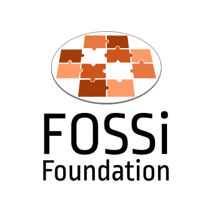

# GSoC'21: Final Report

  
  &emsp;&emsp;&emsp;
  

## Project: [Porting BaseJump STL to FuseSoC](https://summerofcode.withgoogle.com/projects/#5283541157412864)

Organisation: [The Free and Open Source Silicon Foundation (FOSSi)](https://www.fossi-foundation.org/)

Mentors: [Dan Petrisko](https://github.com/dpetrisko), [Prof. Michael B. Taylor](https://github.com/taylor-bsg) and [Olof Kindgren](https://github.com/olofk)

## Abstract
BaseJump STL is to the hardware world as C++ STL is to the software world. It is a comprehensive hardware library for SystemVerilog that seeks to contain all the commonly used hardware primitives. FuseSoC is a package manager and set of build tools for reusable hardware building blocks facilitating the sharing of designs between projects and reusing open IP cores.

The objective of my project is to port BaseJump STL to FuseSoC so that new projects can directly reuse these hand-optimized IP cores rather than starting from scratch. BaseJump STL has the hardware primitives defined in the form of SystemVerilog modules. FuseSoC makes use of core files that reference the provider, file sets and default targets allowing for the reuse of IP cores in the process of creating, building and simulating SoC solutions. FuseSoC allows for easier tracking and downloading of dependencies as well as versioning using VLNV tags making it much more convenient to work with large cores as well as keep track of changes to these cores. This project will involve porting all the modules as well as the testing infrastructure in BaseJump STL to work with FuseSoC.

## Objectives
1. Create core files for all BaseJump STL modules
1. Add lint targets for all cores
1. Port testbenches to work with verilator
1. Add verilator testbench targets for cores with testbenches
1. Create FuseSoC generator for generated cores like `bsg_round_robin_arb`

## Results
All the proposed objectives have been completed and additional work has been done in order to better the project.

## Objectives Completed
From the proposed objectives the following have been completed:

### 1. Core files have been created for all the BaseJump STL modules

- FuseSoC core files created for all the modules in BaseJump STL with filesets and provider defined.
- Repository - [adithyasunil26/basejump_stl_cores](https://github.com/adithyasunil26/basejump_stl_cores)

Status: Complete. The cores have been tested for missing files and dependancies.

### 2. Lint targets have been added and tested

- Lint targets were added to all the previously created core files and tested.
- Necessary debugging was done on the original modules and warning ignore tags added for those that were not problematic.
- Repository - [adithyasunil26/basejump_stl_cores](https://github.com/adithyasunil26/basejump_stl_cores)

Status: Complete. The core files have been tested for the lint targets.

### 3. All existing and compatible testbenches were modified to work with verilator

- Existing testbenches were modified to work with verilator.
- Non-verilatable components had to be excluded or conditions had to be placed to switch between components depending on simulator.
- Pull Request to [bespoke-silicon-group/basejump_stl](https://github.com/bespoke-silicon-group/basejump_stl)- [#449 Verilatable testbenches](https://github.com/bespoke-silicon-group/basejump_stl/pull/449)

Status: Complete. The PR has been merged.

### 4. Verilator testbenches have been added to the cores

- All the new modified testbenches have been added to the cores.
- New target `verilator_tb` set up for veriltor testebenches.
- Repository - [adithyasunil26/basejump_stl_cores](https://github.com/adithyasunil26/basejump_stl_cores)
- Pull Request to [adithyasunil26/basejump_stl_cores](https://github.com/adithyasunil26/basejump_stl_cores)- [#1 Adding testbenches to cores](https://github.com/adithyasunil26/basejump_stl_cores/pull/1)

Status: Complete. The PR has been merged.

### 5. FuseSoC generator created for [`bsg_round_robin_arb`](https://github.com/bespoke-silicon-group/basejump_stl/blob/master/bsg_misc/bsg_round_robin_arb.py)

- FuseSoC generator script and core file created for `bsg_round_robin_arb` generator.
- This will allow users to generate `bsg_round_robin_arb` cores as per their channel requirments directly through FuseSoC.
- Repository - [adithyasunil26/basejump_stl_generators](https://github.com/adithyasunil26/basejump_stl_generators)

Status: Complete. The generator has been tested.

The following are additional objectives which were not part of the initial proposal that have been completed:

### 6. FuseSoC generator created for bsg_fakeram

- Cretaed FuseSoC generator for BSG Black-box SRAM Generator.
- Repository - [adithyasunil26/bsg_fakeram_generator](https://github.com/adithyasunil26/bsg_fakeram_generator)

Status: Complete. The generator has been tested both individually and as a dependancy in [adithyasunil26/basejump_stl_alu](https://github.com/adithyasunil26/basejump_stl_alu).

### 7. ALU module created as a proof of concept

- Created an ALU core using cores from the BaseJump cores and the `bsg_fakeram` generator as a proof of concept of this project and tested successfully.
- Repository - [adithyasunil26/basejump_stl_alu](https://github.com/adithyasunil26/basejump_stl_alu)

Status: Complete. The cores have been tested.

### 8. Empty testbenches have been added for modules without testbenches

- Empty testbenches added to the repository for modules without testbenches.
- These will be used whenever the tb target is called from FuseSoC.
- They can be modified at later stages for actual testing.
- Pull Request to [bespoke-silicon-group/basejump_stl](https://github.com/bespoke-silicon-group/basejump_stl) - [#459 Empty testbenches](https://github.com/bespoke-silicon-group/basejump_stl/pull/459)

Status: Complete. Reviewed but pending merge.

### 9. Yosys targets have been added to all cores

- Yosys targets have been added to all the cores to make it possible to synthesize them for the yosys supported vendors and boards.
- Pull Request [adithyasunil26/basejump_stl_cores](https://github.com/adithyasunil26/basejump_stl_cores)- [#4 Adding yosys targets](https://github.com/adithyasunil26/basejump_stl_cores/pull/4)
- Pull Request to [bespoke-silicon-group/basejump_stl](https://github.com/bespoke-silicon-group/basejump_stl)- [#485 Adding BSG_INV_PARAM exception for yosys](https://github.com/bespoke-silicon-group/basejump_stl/pull/485)

Status: Complete. Pending testing, review and merge.

### 10. Python 3 compatibility for bsg_round_robin_arb generator

- The `bsg_round_robin_arb` generator has been modified to work with Python 3 by using `print_function` from `__future__`.
- Pull Request to [bespoke-silicon-group/basejump_stl](https://github.com/bespoke-silicon-group/basejump_stl) - [#454 python3 compatibility for bsg_round_robin_arb](https://github.com/bespoke-silicon-group/basejump_stl/pull/454)

Status: Complete. Reviewed but pending merge.

## Ongoing Work

### 1. Code coverage measurments for BaseJump STL modules

- Verilator has built in code coverage analysis.
- Currently working on setting up a script to generate code coverage reports.

Status: In Progress.

### 2. Porting BlackParrot to FuseSoC

- With the BaseJump STL cores ready it is now possible to start work on porting [BlackParrot](https://github.com/black-parrot/black-parrot) to FuseSoC.
- Curretnly working on setting up the filesets and lint targets.

Status: In Progress.

## Future Plans
I will continue to work with the organisation to improve the project and add more features and here are some things I have in mind for the future:

1. Establish a CI\CD pipeline for BaseJump STL
1. Complete porting Blackparrot to FuseSoC
1. Add FuseSoC targets for industrial tools like VCS to the BaseJump STL cores.
1. Explore the possibility of adding open-source FPGA and ASIC flows

## More details
You can find more information about the project on my blog post [here](https://adithyasunil26.medium.com/gsoc21-the-summer-in-review-44d3954ee6f4). You can find more about the weekly progress of the project on my weekly blogs [here](https://adithyasunil26.medium.com/).

## Acknowlegements

I would like to thank my mentors Dan Petrisko, Prof. Michael B. Taylor and Olof Kindgren for all their guidance and support. Without them this project would not have progressed as far as it has now. They have always been providing valuable feedbacks and suggestions based on which I shaped my work.

I am also grateful to [The Free and Open Source Silicon Foundation (FOSSi)](https://www.fossi-foundation.org/) community members for their support throughtout the project. I also thank Google for giving me this opportunity to work on this project through the [Google Summer of Code](https://summerofcode.withgoogle.com/) program.
